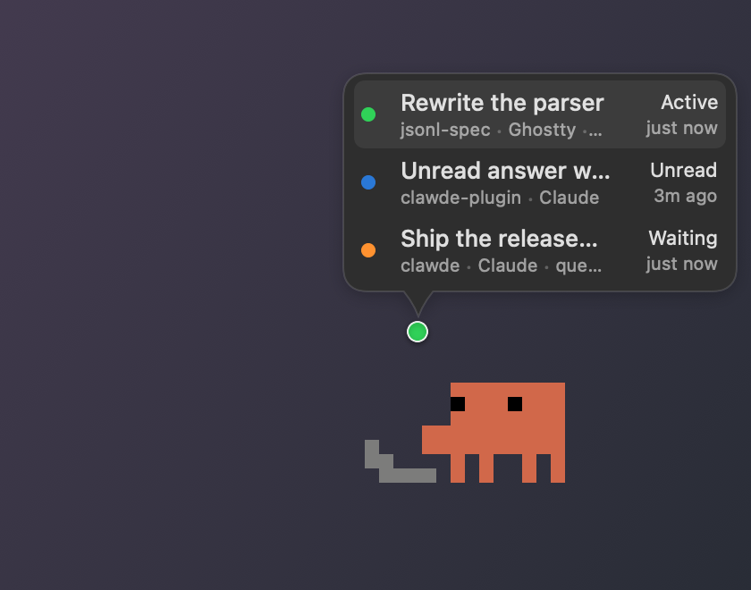
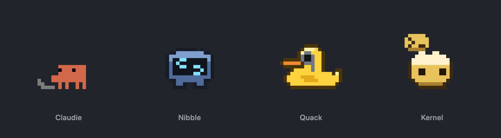

# Clawde

A desktop pet that acts out your Claude Code sessions, and a menu bar list of every one of them.




Claude Code sessions run in windows you are not looking at. Clawde puts one small character above
everything else, doing whatever the session that most wants you is doing: typing while it works,
waving while it waits on you, dozing when there is nothing to say. You notice it out of the corner
of your eye, click it, and you are in that session.

## The pet



Four characters, each drawn frame by frame on a 20×16 canvas. **Claudie** pulls out a laptop and
types, **Nibble**'s eyes turn into see-sawing braces, **Quack** inspects the work through a
magnifying glass, **Kernel** pops out tiles of code. Every mood has its own animation — working,
waiting on you, an answer nobody has read, compacting, idle, and resting when nothing is running —
each with an entrance and an exit, so the laptop is never dropped in mid-air.

- **Hover** and a bubble opens out of the badge, listing every session that is doing something,
  then the idle one that did something last. Each line reads like the menu bar's: the session's
  name over its folder and host app, its state over how long ago. Move along the lines and the pet
  acts out that session; click one and it opens.
- **The badge** beside its head counts the sessions that want attention, in the colour of whatever
  the pet is showing.
- **It hops** when a session takes up something new, and when you click it.
- **Click** to jump to the session, **drag** to move it — anywhere below the menu bar, the Dock's
  edge included — **right-click** for the session list, settings, or to send it away.
- **Size** is a slider, from 60 × 48 points to 300 × 240, whole points per pixel so the art stays
  crisp. Under Reduce Motion each mood holds a single still frame.

Off by default. Turn it on in Settings, or with the paw button at the top of the menu bar dropdown.

## In the menu bar


Every live session, the one that most wants you at the top: what it is doing, the name it goes by,
its folder and host app, and how long ago it last moved. Click a row and Clawde brings that session
forward — the right tab in iTerm2 or Ghostty, the right window in VS Code, Xcode or a JetBrains
IDE, the right conversation in the Claude desktop app.

| State | Dot | Meaning |
|---|---|---|
| Active | green | Claude is working — a tool, a reply being written |
| Waiting | orange | It is blocked until you answer |
| Unread | blue | Claude has spoken since you last looked at that session |
| Compacting | blue | Context compaction is running |
| Idle | grey | Nothing since its last turn |

**Unread** is the one the hook cannot see: for sessions run by the Claude desktop app, Clawde
compares the time of Claude's last answer in the transcript against the last time that session was
actually on screen, which it learns from the app's own log. A session the app has stopped stays on
the list, as last seen, until its answer is read.

**A question at the end of a turn** is reported as waiting by the hook. If you would rather see
those as finished, turn off *Questions Count as Waiting* in Settings; a real permission prompt still
counts as waiting either way.

**Sessions started by a script** with `claude --remote-control` show as Claude, and a click opens
them in the app rather than bringing forward a terminal that has nothing to do with them.

**Several Claude Code profiles** (`CLAUDE_CONFIG_DIR`) are watched at once, each toggled in
Settings. **Desktop widgets** show the same picture on the desktop, and a daily usage bar tracks
time in each state.

## What tells it what is happening

A Claude Code plugin — [clawde-plugin](https://github.com/burakCokyildirim/clawde-plugin), a small
Rust daemon — hooks session lifecycle events, tails the session's JSONL transcript, writes state to
`<project>/<session-id>.cstatus`, and posts a Darwin notification when it changes. Clawde also
watches those files and polls every five seconds, so it still works if the notification is missed.
The app offers to install the plugin on first launch.

## Install

Download the [latest release](https://github.com/burakCokyildirim/clawde/releases/latest): open the
`.pkg`, or unzip the `.zip` into `/Applications`. Both are signed with a Developer ID and notarized,
so they open without argument. It runs in the menu bar with no Dock icon; the pet is off until you
switch it on, from Settings or the paw button at the top of the dropdown. After that it updates
itself.

On first launch it offers to install its hook plugin, which is what tells it when a session changes
state. Restart any Claude Code sessions that were already running — a session keeps the hooks it
started with.

Requires macOS 15 or newer and the Claude Code CLI.

To build it instead:

```bash
git clone --recurse-submodules https://github.com/burakCokyildirim/clawde.git
cd clawde
xcodebuild -project Clawde.xcodeproj -scheme Clawde -configuration Release \
  CODE_SIGNING_ALLOWED=NO build
```

That needs Xcode 26+. The `justfile` has the shortcuts used day to day (`just build`, `just test`,
`just swap`).

### Upgrading from Claude Status

Clawde was forked from [Claude Status](https://github.com/gmr/claude-status) and has since taken
identifiers of its own, so the two are separate apps. If you have the old one:

- **Uninstall its plugin**, or the old hook keeps the daemon and Clawde never hears about a
  change: `claude plugin uninstall claude-status@claude-status-marketplace`. A Claude Code session
  keeps the hooks it started with, so restart the sessions that are already running — until you
  do, theirs still report to the old name and Clawde falls back to watching files and polling.
- **Remove the old app from Finder**, not from a shell: macOS App Management refuses `rm` and `mv`
  on an installed app bundle even for an admin.
- **Expect a fresh start.** Nothing carries over: macOS keeps a group container to the apps
  entitled to it, and the one Claude Status writes to belongs to that project's team, so there is no
  way for this app to read it. Settings are quick to set again, and the pet is off until you say so.
- Widgets you had placed need adding again, and macOS asks once more for permission to send Apple
  Events, because the app it granted that to is a different app now.

## Credits

Forked from [gmr/claude-status](https://github.com/gmr/claude-status) by Gavin M. Roy and AWeber
Communications, Inc., which is the menu bar app, the widgets, the productivity tracking and the
hook plugin this project grew out of. Everything about the pet, the session naming, the unread
signal and Remote Control support was added here. Neither the original authors nor AWeber endorse
this fork.

[BSD 3-Clause License](LICENSE), the licence it was forked under.
