<p align="center">
  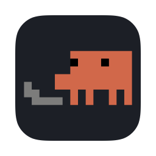
</p>

<h1 align="center">Clawde</h1>

<p align="center">
  A desktop pet that acts out your Claude Code sessions,<br>
  and a menu bar list of every one of them.
</p>

<p align="center">
  <a href="https://github.com/burakCokyildirim/clawde/releases/latest"></a>
  
  
  <a href="LICENSE"></a>
</p>

<p align="center">
  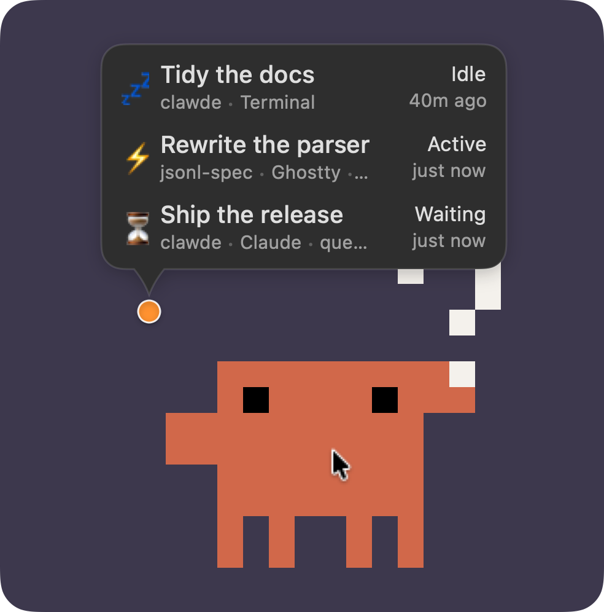
</p>

Claude Code sessions run in windows you are not looking at. Clawde puts one small character above
everything else, doing whatever the session that most wants you is doing: typing while it works,
waving while it waits on you, dozing when there is nothing to say. You notice it out of the corner
of your eye, click it, and you are in that session.

## It acts out the session

<p align="center">
  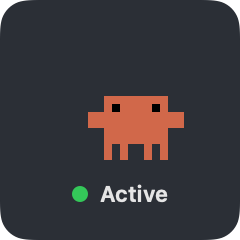
  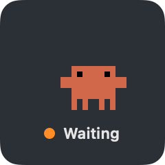
  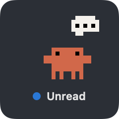
  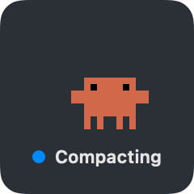
  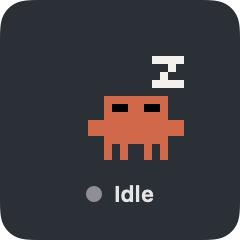
  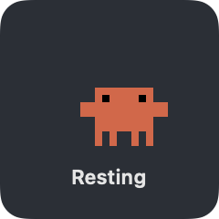
</p>

Every mood has its own animation, each with an entrance and an exit, so the laptop is never
dropped in mid-air. The pet stands for the session that most wants you — one waiting on you first,
then an answer nobody has read, then work in progress — and the badge beside its head counts the
sessions that are busy, in the colour of whatever it is showing. It hops when a session takes up
something new.

## Four characters

<p align="center">
  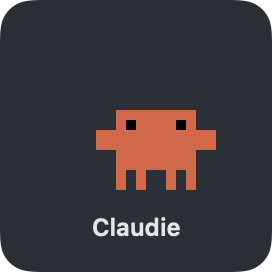
  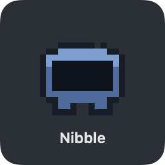
  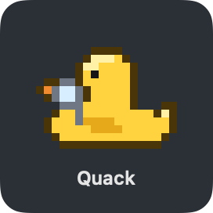
  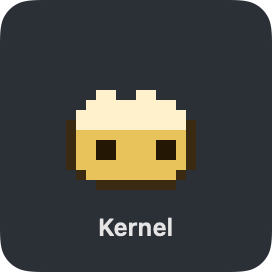
</p>

**Claudie** pulls out a laptop and types, **Nibble**'s eyes turn into see-sawing braces, **Quack**
inspects the work through a magnifying glass, **Kernel** pops out tiles of code. Each is drawn frame
by frame on a 20 × 16 canvas and sized in whole points per pixel, from 60 × 48 up to 300 × 240, so
the art stays crisp at any size. Pick one in Settings.

**Draw your own.** A character is one Swift file of pixel art written as letters. Open this
repository in Claude Code and run `/new-character`: it draws one with you, shows you every mood
animated and wires it into the app (a cat that walks across the keyboard while it works, an
octopus typing on four keyboards at once, a coffee mug that drains while the context compacts, a
snail leaving a trail of semicolons). [Making a character](docs/characters.md) covers doing it by
hand, and [CONTRIBUTING](CONTRIBUTING.md) how to send it in.

## Living with it

- **Hover** and a bubble opens out of the badge, listing every session that is doing something,
  then the idle one that did something last. Each line reads like the menu bar's: the session's
  name over its folder and host app, its state over how long ago. Move along the lines and the pet
  acts out that session; click one and it opens.
- **Click** the pet to jump to its session, **drag** it anywhere below the menu bar — the Dock's
  edge included — and **right-click** for the session list, settings, or to send it away.
- **Reduce Motion** is honoured: each mood holds a single still frame, and nothing hops.
- **It costs next to nothing.** The pet polls nothing of its own and runs no timer while it is
  hidden or covered; it wakes only when the frame on screen is due to change.

The pet is off by default. Turn it on in Settings, or with the paw button at the top of the menu
bar dropdown.

## In the menu bar

<p align="center">
  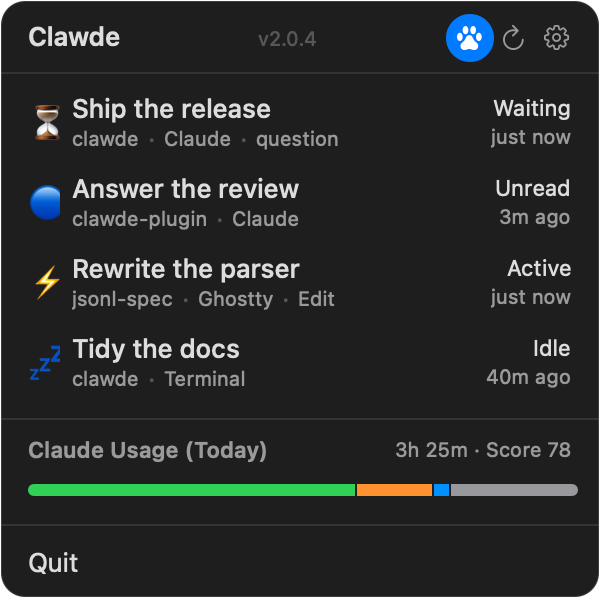
</p>

Every live session, the one that most wants you at the top: what it is doing, the name it goes by,
its folder and host app, and how long ago it last moved. Click a row and Clawde brings that session
forward — the right tab in iTerm2, Terminal or Ghostty, the right window in VS Code, Xcode or a
JetBrains IDE, the right conversation in the Claude desktop app.

| State | Dot | Meaning |
|---|---|---|
| Active | green | Claude is working — a tool, a reply being written |
| Waiting | orange | It is blocked until you answer |
| Unread | blue | Claude has spoken since you last looked at that session |
| Compacting | blue | Context compaction is running |
| Idle | grey | Nothing since its last turn |

**Unread** is the one the hook cannot see: for sessions run by the Claude desktop app, Clawde
compares the time of Claude's last answer in the transcript against the last time that session was
actually on screen, which it learns from the app's own log. A session the app has stopped stays on
the list, as last seen, until its answer is read.

**A question at the end of a turn** is reported as waiting by the hook. If you would rather see
those as finished, turn off *Questions Count as Waiting* in Settings; a real permission prompt still
counts as waiting either way.

**Sessions started by a script** with `claude --remote-control` show as Claude, and a click opens
them in the app rather than bringing forward a terminal that has nothing to do with them.

**Several Claude Code profiles** (`CLAUDE_CONFIG_DIR`) are watched at once, each toggled in
Settings. **Desktop widgets** show the same picture on the desktop, and a daily usage bar tracks
time in each state.

## What tells it what is happening

A Claude Code plugin — [clawde-plugin](https://github.com/burakCokyildirim/clawde-plugin), a small
Rust daemon — hooks session lifecycle events, tails the session's JSONL transcript, writes state to
`<project>/<session-id>.cstatus`, and posts a Darwin notification when it changes. Clawde also
watches those files and polls every five seconds, so it still works if the notification is missed.
Without the plugin the app can still find sessions, but only by polling, and their state is a guess.

### Setting the plugin up

Clawde carries the plugin inside its own bundle and offers to install it on first launch. It does
that by running `claude plugin install`, so it works if you have the Claude Code CLI.

**If you reach Claude Code through the Claude desktop app**, you have no `claude` command to run —
the app has Claude Code built in and ships no CLI. Install it from inside any session instead, the
desktop app's included. Clawde's dropdown says *No plugin installed*; **Set Up…** opens a window
with these two, filled in with the path on your Mac and copyable:

```
/plugin marketplace add /Applications/Clawde.app/Contents/Resources/clawde-plugin
/plugin install clawde@clawde-marketplace
```

The desktop app's own plugin browser (**+** → **Plugins**) works too, once the marketplace above
has been added. There is nothing to set up in the desktop app beyond that: it reads the same
`~/.claude` as the CLI, so one install covers both.

### Then start your sessions again

**A session only reports if it started after the plugin was installed — or updated.** The plugin's
daemon is started by the session's start and by nothing else, so a session already open when the
plugin arrives never gets one; `/reload-plugins` does not change that. Until it starts again, such a
session is listed the slow way, with its state guessed, or not at all.

- **Claude desktop app:** quit it (⌘Q) and open it again. That restarts every session in it at once;
  clicking a session that is already running does not.
- **Terminal:** leave the session and pick it up again with `claude --resume`.

The same goes after Clawde updates the plugin: sessions keep the old version until they start again.

## Install

Download the [latest release](https://github.com/burakCokyildirim/clawde/releases/latest): open the
`.pkg`, or unzip the `.zip` into `/Applications`. Both are signed with a Developer ID and notarized,
so they open without argument, and the app keeps itself up to date after that. It runs in the menu
bar with no Dock icon.

On first launch it offers to install its hook plugin — see [Setting the plugin
up](#setting-the-plugin-up), which is a different path if you use Claude Code through the Claude
desktop app — and then [start your sessions again](#then-start-your-sessions-again): only sessions
that start after the plugin is in will report.

Requires macOS 15 or newer, and Claude Code — the CLI or the desktop app.

To build it instead:

```bash
git clone --recurse-submodules https://github.com/burakCokyildirim/clawde.git
cd clawde
xcodebuild -project Clawde.xcodeproj -scheme Clawde -configuration Release \
  CODE_SIGNING_ALLOWED=NO build
```

That needs Xcode 26+. The `justfile` has the shortcuts used day to day (`just build`, `just test`,
`just swap`). The pictures on this page are rendered from the app's own views and animation engine
by `ClawdeTests/ReadmeAssets.swift`, which says how to run it.

### Upgrading from Claude Status

Clawde was forked from [Claude Status](https://github.com/gmr/claude-status) and has since taken
identifiers of its own, so the two are separate apps. If you have the old one:

- **Uninstall its plugin**, or the old hook keeps the daemon and Clawde never hears about a
  change: `claude plugin uninstall claude-status@claude-status-marketplace`. Then [start your
  sessions again](#then-start-your-sessions-again) — until you do, they still report to the old
  name and Clawde falls back to watching files and polling.
- **Remove the old app from Finder**, not from a shell: macOS App Management refuses `rm` and `mv`
  on an installed app bundle even for an admin.
- **Expect a fresh start.** Nothing carries over: macOS keeps a group container to the apps
  entitled to it, and the one Claude Status writes to belongs to that project's team, so there is no
  way for this app to read it. Settings are quick to set again, and the pet is off until you say so.
- Widgets you had placed need adding again, and macOS asks once more for permission to send Apple
  Events, because the app it granted that to is a different app now.

## Contributing

New characters, terminals and editors Clawde doesn't know yet, and bug fixes are all welcome.
[CONTRIBUTING.md](CONTRIBUTING.md) has the setup and the ground rules.

## Credits

Forked from [gmr/claude-status](https://github.com/gmr/claude-status) by Gavin M. Roy and AWeber
Communications, Inc., which is the menu bar app, the widgets, the productivity tracking and the
hook plugin this project grew out of. Everything about the pet, the session naming, the unread
signal and Remote Control support was added here. Neither the original authors nor AWeber endorse
this fork.

[BSD 3-Clause License](LICENSE), the licence it was forked under.
